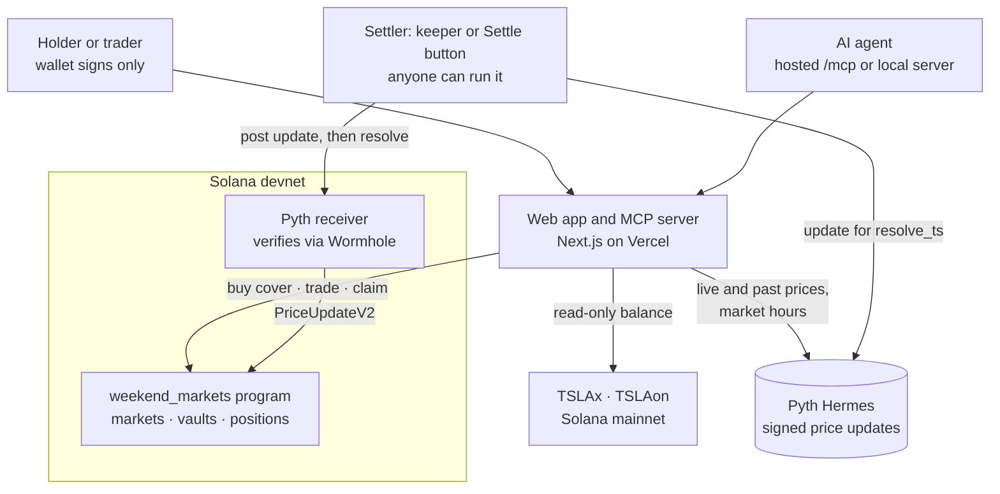

# Weekend Markets

**Gap cover for tokenized stocks.** Hedge the hours Wall Street is closed, settled on Solana by the first Pyth price after the bell.

[](https://github.com/Osiyomeoh/weekend-markets/actions/workflows/ci.yml)

**Live app (Solana devnet):** https://weekend-markets.vercel.app · **Program:** [`2oihGq9YRDQkgeEXwrzGcgs9UjDZVUKeKZCP81UkTSN9`](https://explorer.solana.com/address/2oihGq9YRDQkgeEXwrzGcgs9UjDZVUKeKZCP81UkTSN9?cluster=devnet)

**Try it in a minute:**

1. **As a holder:** switch your wallet to devnet, open [the Cover page](https://weekend-markets.vercel.app/cover), connect, tap **Get funds**, then **Buy cover**.
2. **As an agent:** `claude mcp add --transport http weekend-markets https://weekend-markets.vercel.app/mcp`, then ask Claude *"What's the TSLA gap right now, and what would it cost to cover 10 shares until Monday's open?"*
3. **As a skeptic:** read the [track record](https://weekend-markets.vercel.app/#settlement) on the landing page. Every ladder settled on the first Pyth print at its deadline, and each links to the chain.

> Built for the Solana Foundation **Stocklana** hackathon (September 2026). Everything under [What's built](#whats-built) is in this repo and running on devnet; everything else is labeled as planned.

---

## The problem

xStocks and Ondo have put US stocks on Solana, and people hold them: about 40,000 wallets hold TSLAx, and NVDAx is past 100,000 (Jupiter token data, 24 Sep 2026). There is roughly $87M of TSLAx outstanding. These tokens trade 24/7.

The stock they track has a **32.5-hour regular session each week**. Outside it, trading is thin (pre-market, after-hours and overnight venues), and from Friday 20:00 to Sunday 20:00 ET (48 hours) nothing trades it at all. Whatever happens outside the session (earnings after the close, weekend news) lands all at once on the next opening print. A TSLAx holder on a Friday night can sell into thin weekend liquidity, or hold and take the gap.

**What the open does, from Pyth's own prints:** across the 46 openings since Pyth's TSLA history begins (22 July 2026), the average close-to-open move was 1.1%, and 4 were over 2%. On 23 July Tesla opened 8.8% below the previous close: about $329 on 10 shares, before a holder could act. ([`app/scripts/gaps.ts`](app/scripts/gaps.ts) rebuilds these from Hermes; the close is the first print at or after 16:00 ET, the open the first at or after 09:30 ET.) They can't buy a put: options need a brokerage account and options approval, and they don't cover a token sitting in a Solana wallet.

## What Weekend Markets does

**For holders: gap cover.** Enter how many shares you hold, or connect a wallet and the app reads your TSLAx and TSLAon balance from mainnet (read-only). Pick where cover starts and how far down it goes. You see the cost, the most it can pay, and a chart of your P&L at the opening print with and without cover. One transaction buys it. When the bell rings, the market settles on the first Pyth price and you claim.

Example from the live app: covering 10 TSLA at $378.74 down to $347.50 costs **64.31 tUSDC (1.7% of the position)** and pays up to **312.35** if TSLA opens below $347.50.

**For everyone else: the other side.** Every strike is a YES/NO pool: "TSLA at or above $362.50 at Monday's open?" It's quoted in cents like any prediction market, and anyone can trade it. Together, the pools are the crowd's forecast of the opening price, drawn as a curve with its 50% level.

**For agents: cover as a tool.** An [MCP server](#for-agents) gives Claude, or any agent that speaks MCP, the whole product as tools: read the gap, quote cover sized to a position (or to what a mainnet wallet holds), buy it, follow it, settle and claim. The agent signs with its own devnet wallet under a spending cap set by whoever runs it. Cover never pays more than the position loses, so an agent can hedge with it but can't gamble with it.

### How cover is built

A put pays `shares × (spot − price)` below spot. The ladder can't pay that exactly, but a strip of NO stakes pays it in steps: one leg per strike below spot, each sized to pay `shares × (gap to the strike above)`. If the stock settles below strike *k*, every leg at or above *k* wins, and those payouts add up to `shares × (spot − k)`, the loss at *k*. So:

- above the first strike, cover pays nothing (the deductible, which you choose);
- below it, cover trails your loss by less than one strike step;
- it never pays more than you lose, so it's a hedge, not a bet.

Each leg's stake comes from inverting the pool payout exactly, including the stake's own effect on the pool ([`app/src/lib/cover.ts`](app/src/lib/cover.ts), unit tested).

## For agents

An agent managing a tokenized-stock portfolio holds over the weekend like anyone else, and there's no hedge it can call today. The MCP server in [`app/mcp`](app/mcp) lets one buy gap cover the way a person does in the app. There are two ways to use it.

### Add it by URL: no install, no keys

```bash
claude mcp add --transport http weekend-markets https://weekend-markets.vercel.app/mcp
```

Or add `https://weekend-markets.vercel.app/mcp` as a custom connector in any MCP client. The hosted server holds no keys and spends nothing: `cover_transaction` returns the purchase as an unsigned transaction for the buyer's own wallet to sign. `npm run agent:smoke:hosted` checks it through the protocol.

### Run it with its own wallet

The local server adds a devnet wallet for the agent, so it buys, follows and claims by itself. The repo's [`.mcp.json`](.mcp.json) registers it for Claude Code: after `cd app && npm install`, open the repo in Claude Code and approve the `weekend-markets` server. Elsewhere:

```bash
cd app && npm install
claude mcp add weekend-markets -e AGENT_MAX_SPEND=100 -- node "$PWD/node_modules/tsx/dist/cli.mjs" "$PWD/mcp/server.ts"
```

Then ask, for example: *"I'm holding 10 TSLAx over the weekend. Protect me if Tesla opens Monday below $362.50, and spend at most $100."*

| Tool | Where | What it does |
|---|---|---|
| `gap_now` | both | Tesla's latest Pyth price, whether Wall Street is open, and where TSLAx trades on Solana right now |
| `list_ladders` | both | Open ladders: deadline, when stakes close, YES/NO odds per strike |
| `quote_cover` | both | Cost, most it pays, and the payout below each strike, for `shares` or for what a mainnet `holder` wallet holds |
| `track_record` | both | Every settled ladder: the Pyth print, when it was published, which strikes paid |
| `pre_ipo_gap` | both | PreStocks pre-IPO tokens against PreStocks' own marks: the premium or discount a buyer pays |
| `settle` | both | Settles due ladders on the first Pyth print at or after the deadline |
| `cover_transaction`, `positions` | hosted | The purchase as an unsigned transaction for any wallet; any wallet's positions |
| `wallet`, `get_test_funds` | local | The agent's own devnet wallet, created on first use, and test USDC from the faucet |
| `buy_cover` | local | Buys the quoted cover in one transaction, only if it costs no more than `max_cost` |
| `my_cover`, `claim` | local | Follow the agent's positions and collect payouts |

Guardrails for the local agent:

- It only runs on devnet: the server checks the cluster's genesis hash before it signs anything.
- Each purchase is capped twice: by `max_cost` on the call, and by `AGENT_MAX_SPEND`, set by the person running the agent. A purchase above either fails before anything is sent.
- It never sees our keys. Prices, holdings, the faucet and settlement go through the app's public routes. The agent's wallet lives in `keys/agent.json` (gitignored, owner-only permissions), and the code that touches it (`mcp/wallet.ts`) isn't part of the hosted server.

`npm run agent:smoke` runs the whole flow through the MCP protocol with a separate wallet: it lists the tools, funds the wallet, reads the gap, checks that both spending guards refuse, buys cover for one share, and reads it back.

### Any wallet or agent: a Solana Action

Agents without MCP, and wallets and Blink clients, can use the same cover over plain HTTP, following the [Solana Actions](https://solana.com/docs/advanced/actions) spec:

```
GET  https://weekend-markets.vercel.app/api/actions/cover            → live quote and buttons
POST https://weekend-markets.vercel.app/api/actions/cover?shares=10  { "account": "<wallet>" }
                                                                      → { "transaction": "<base64, ready to sign>" }
```

`shares=held` sizes the cover to the TSLAx and TSLAon the signer holds on mainnet. A brand-new devnet wallet is sent test funds in the same call, so one click works from nothing. [`/actions.json`](https://weekend-markets.vercel.app/actions.json) maps the Cover page to the action. `npm run smoke` buys through it with an empty wallet.

## Pre-IPO tokens: PreStocks

[PreStocks](https://prestocks.com) puts private companies on Solana: OpenAI, Anthropic, SpaceX, Anduril and more, as Token-2022 tokens. The tokens trade around the clock; the companies don't trade at all. PreStocks publishes a mark for each company, so the distance between a token's price and its mark is the premium (or discount) a buyer pays today. That's the same question gap cover answers for listed stocks: how far the token is from what's underneath.

The [Pre-IPO page](https://weekend-markets.vercel.app/pre-ipo) shows that gap for every PreStocks token, live from their API (on 25 Sep: OpenAI +27.8%, Neuralink +34.4%, SpaceX −19.6%). Connect a wallet and it reads your PreStocks balances from mainnet, valued at the market and at the mark. Agents get the same table through the `pre_ipo_gap` MCP tool.

Cover for pre-IPO holders comes next, and it will settle the same way as TSLA: on Pyth, not on any issuer's number. Pyth already publishes `Equity.Index.OPENAI/USD` and `Equity.Index.ANTHROPIC/USD` around the clock; our key isn't entitled to them yet, so we don't open markets on them. The prices on the Pre-IPO page are display only: nothing settles on them.

## Why Solana

1. **The holders are here.** xStocks and Ondo tokenized stocks are Token-2022 tokens on Solana, so cover can read what a wallet holds and settle in dollars on the same chain.
2. **The price is verified, not trusted.** The signed Pyth update is checked through Wormhole by Pyth's receiver program, and our program reads it in the same transaction set. Nobody proposes a result and there's no committee or dispute window.
3. **Settling is cheap and fast.** A settlement costs about a cent in fees (the `resolve` transaction is 13,250 lamports) and is final seconds after the print. That makes it worth running a fresh ladder per stock, per session.

## How it compares

| | Polymarket | Kalshi | Nexus Mutual | **Weekend Markets** |
|---|---|---|---|---|
| What you buy | Stock price contracts (e.g. "TSLA hits $X this week") | Index range contracts | Cover against protocol hacks | **Cover sized to your stock position**, or any strike |
| Sized to what you hold | No | No | You enter an amount | **Reads your TSLAx/TSLAon; the strip is sized to your shares** |
| How it resolves | Pyth data, but the result is proposed through UMA and open to dispute | Kalshi reads its data source | Claim with proof of loss, then a member vote | **Signed Pyth print checked by the program; anyone can submit it** |
| Time to payout | After the challenge period | About 3h after the close | 14-day wait before a claim can be filed | **Claimable seconds after settlement** |
| Exit before settlement | Yes | Yes | n/a | **No** (pool-based, see [Limits](#limits)) |

## Settlement, precisely

`resolve` is permissionless. Anyone can settle a market by passing a Pyth `PriceUpdateV2` account, and the program only accepts **the first Pyth print at or after the deadline**:

```
prev_publish_time < resolve_ts <= publish_time <= resolve_ts + window
```

The `prev_publish_time` check stops a resolver from choosing whichever price inside the window suits them. The update must also be fully Wormhole-verified, owned by the Pyth receiver program, for the market's feed, positive, and within the market's confidence bound (1% of price on the live ladders). A tie with the strike settles YES.

If a strike has stakes on only one side when betting closes, or no valid print arrives in the window, the market voids and every stake is refunded. Winners split the whole pool pro rata, rounded down. There's no fee and no house, and payouts never exceed the vault.

**Verified on devnet with a real Pyth print:** a 3-strike TSLA ladder set to settle at 11:59:49 UTC on 24 Sep 2026 settled on a Pyth print of **$376.7066 published at exactly 11:59:49**. The $375 strike paid YES; $377.50 and $380 paid NO. [Settlement transaction](https://explorer.solana.com/tx/3kQR5P7sgCzDNnQwyGrH4QY7CRDWJ7iFHk7SBRLVrshmiRPfUdMbVFJP7rUgRhHPTBE7cYBrtcZ4boPskLYWzVtv?cluster=devnet).

## Architecture



- **Program** ([`programs/weekend-markets`](programs/weekend-markets)): Anchor 1.2 with `pyth-solana-receiver-sdk` 2.0 (`pro-compatible`, the receiver after Pyth's August 2026 Core upgrade). Instructions: `create_market`, `place_bet`, `resolve`, `void_market`, `claim`, `close_market`. Collateral is classic SPL Token only, since Token-2022 transfer fees and hooks would break the pool accounting.
- **Operator:** creates ladders, seeds them, runs the faucet and pays fees to post settlement prices. It has no special power in the program: `resolve` and `void_market` are permissionless, and it can't touch anyone's stake.
- **Keeper and settle route:** fetch the update for `resolve_ts` from Hermes, run the same timing check the program runs (so they never pay to post a price that would be rejected), post it through the Pyth receiver once per ladder and call `resolve` for every strike in the same transaction set, then close the temporary price account to recover rent.
- **Always on:** a scheduled job calls the keeper every 10 minutes. It settles whatever is due and opens a new ladder for every opening bell, so the app runs without anyone at a laptop. It takes exchange holidays from Pyth's own market-hours schedule for the feed, so it never opens a ladder for a day Pyth won't price.

## What's built

- **Program on devnet**, with 6 instructions. 12 unit tests cover the settlement math. 25 LiteSVM integration tests cover every instruction and failure path: stale, cherry-picked, forged, partially verified and low-confidence prices; one-sided and empty pools; rounding dust; double claims; unauthorized claims and closes.
- **Web app** at https://weekend-markets.vercel.app:
  - gap cover with mainnet holdings lookup, deductible and depth choice, payoff chart;
  - strike ladders with a cents-quoted order ticket and the rules shown before trading;
  - a four-step start guide that ticks off from on-chain state;
  - positions described by what they pay, one-click claim;
  - a "Right now" panel: TSLAx on Solana against Tesla's latest Pyth price, so a holder sees the weekend gap as it forms;
  - a track record of every settled ladder, read from the chain;
  - a chart of every TSLA close-to-open move since July, from Pyth history;
  - a Pre-IPO page: every PreStocks token against its mark, with your PreStocks balances read from mainnet;
  - devnet faucet.
- **MCP server for agents:** hosted at `/mcp` (8 tools, no keys) and runnable locally with the agent's own wallet (11 tools, a devnet-only check and two spending limits), with smoke tests that drive both through the MCP protocol.
- **Solana Action (Blink) for cover:** a live quote on GET and a ready-to-sign transaction on POST, funding new wallets in the same call.
- **Always-on keeper:** settles due ladders and opens the next opening-bell ladder every 10 minutes (GitHub Actions calling a secured route).
- **TypeScript client, keeper and operator scripts:** `series` (open a ladder), `add-liquidity`, `tick` and `keeper` (one pass, or every minute), `status`, and `smoke` (runs the whole user flow against a deployed app with a fresh wallet).
- **42 TypeScript unit tests** for the ladder and cover math and the US session calendar (daylight saving, weekends, holidays from Pyth's schedule).

## Limits

These are the honest ones:

- **Devnet and test money.** Stakes are in tUSDC, a test token our faucet mints. Nothing here is real money.
- **TSLA only, for now.** Our Pyth API key is entitled to `Equity.US.TSLA/USD`. NVDA, AAPL and SPY, and the xStock and Ondo 24/7 feeds, are wired in and appear as soon as those feeds are entitled.
- **Liquidity is seeded.** The operator seeds each strike with 5,000 tUSDC at model odds. That stands in for market makers, and it's a real counterparty that can lose.
- **No early exit.** Pools are parimutuel, so a position is held to settlement, and the payout shown is an estimate until betting closes.
- **Claims are one click, not automatic.** `claim` requires the owner's signature.
- **What "the open" means.** Markets settle on the first Pyth `Equity.US` print at or after 09:30 ET. That is Pyth's aggregate price, not the exchange's official opening auction. The keeper skips exchange holidays using Pyth's market-hours schedule; if an unscheduled halt leaves no print in the window, the market voids and refunds.
- **Regulation.** Binary contracts on stock prices are regulated in most places (in the US, by the CFTC and SEC). A mainnet launch would need legal review and geofencing first. This is a devnet prototype.

## Planned

- **Exit before settlement** with an order book or AMM over the same Pyth settlement (Solana Perps & Prediction Markets hackathon).
- **Automatic claims:** a program change letting a keeper pay winners straight to their token account.
- **Weekend drift from Pyth:** the "Right now" panel reads TSLAx from Jupiter today; it switches to Pyth's 24/7 xStock feed once our key is entitled to it.
- **An AI market maker** quoting the ladders from Pyth data (Colosseum).

## Devnet addresses

| | |
|---|---|
| Program | `2oihGq9YRDQkgeEXwrzGcgs9UjDZVUKeKZCP81UkTSN9` |
| Collateral (tUSDC, 6 decimals) | `4HbeqsK5hFEFpLJNHEs1kz5CSePjF3k6qqwzuTPfE35Q` |
| Operator (market creator) | `955ZtZxaANGiNrUZahGNxBY3rKhTBSkCYqG94EAerV1Y` |
| Pyth receiver | `rec2HHDDnjLfj4kE7VyEtFA1HPGQLK33259532cRyHp` |
| Pyth feed `Equity.US.TSLA/USD` | `0x16dad506d7db8da01c87581c87ca897a012a153557d4d578c3b9c9e1bc0632f1` |

## Run it yourself

Program (Rust, Solana CLI 4.1.x, Anchor 1.2.0):

```bash
anchor build --arch v0
cargo test -p weekend-markets
```

`--arch v0` targets SBPF v0, which every cluster and LiteSVM support (Anchor 1.2 defaults to v3).

App (Node 20+): see [`app/README.md`](app/README.md) for environment variables and operator scripts.

```bash
cd app
npm install
npm test
npm run dev
```

## License

MIT
