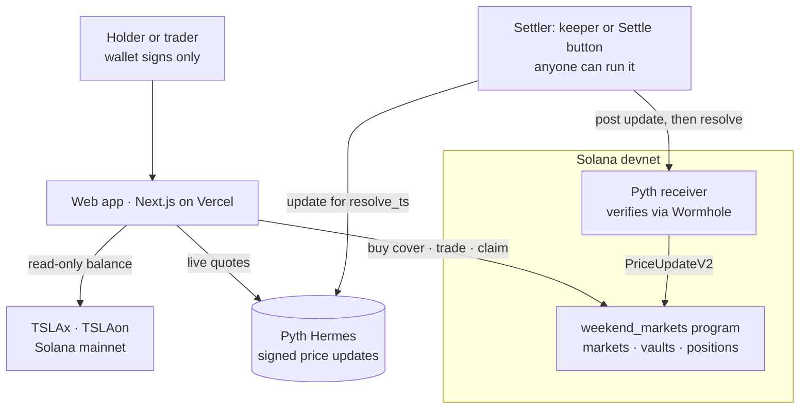

# Weekend Markets

**Gap cover for tokenized stocks.** Hedge the hours Wall Street is closed, settled on Solana by the first Pyth price after the bell.

**Live app (Solana devnet):** https://weekend-markets.vercel.app · **Program:** [`2oihGq9YRDQkgeEXwrzGcgs9UjDZVUKeKZCP81UkTSN9`](https://explorer.solana.com/address/2oihGq9YRDQkgeEXwrzGcgs9UjDZVUKeKZCP81UkTSN9?cluster=devnet)

> Built for the Solana Foundation **Stocklana** hackathon (September 2026). Everything under [What's built](#whats-built) is in this repo and running on devnet; everything else is labeled as planned.

---

## The problem

xStocks and Ondo have put US stocks on Solana, and people hold them: about 40,000 wallets hold TSLAx, and NVDAx is past 100,000 (Jupiter token data, 24 Sep 2026). There is roughly $87M of TSLAx outstanding. These tokens trade 24/7.

The stock they track trades **32.5 hours a week**. Whatever happens in the other 135.5 hours (earnings after the close, weekend news) lands all at once on the next opening print. A TSLAx holder on a Friday night can sell into thin weekend liquidity, or hold and take the gap. They can't buy a put: options need a brokerage account and options approval, and they don't cover a token sitting in a Solana wallet.

## What Weekend Markets does

**For holders: gap cover.** Enter how many shares you hold, or connect a wallet and the app reads your TSLAx and TSLAon balance from mainnet (read-only). Pick where cover starts and how far down it goes. You see the cost, the most it can pay, and a chart of your P&L at the opening print with and without cover. One transaction buys it. When the bell rings, the market settles on the first Pyth price and you claim.

Example from the live app: covering 10 TSLA at $378.74 down to $347.50 costs **64.31 tUSDC (1.7% of the position)** and pays up to **312.35** if TSLA opens below $347.50.

**For everyone else: the other side.** Every strike is a YES/NO pool: "TSLA at or above $362.50 at Monday's open?" It's quoted in cents like any prediction market, and anyone can trade it. Together, the pools are the crowd's forecast of the opening price, drawn as a curve with its 50% level.

### How cover is built

A put pays `shares × (spot − price)` below spot. The ladder can't pay that exactly, but a strip of NO stakes pays it in steps: one leg per strike below spot, each sized to pay `shares × (gap to the strike above)`. If the stock settles below strike *k*, every leg at or above *k* wins, and those payouts add up to `shares × (spot − k)`, the loss at *k*. So:

- above the first strike, cover pays nothing (the deductible, which you choose);
- below it, cover trails your loss by less than one strike step;
- it never pays more than you lose, so it's a hedge, not a bet.

Each leg's stake comes from inverting the pool payout exactly, including the stake's own effect on the pool ([`app/src/lib/cover.ts`](app/src/lib/cover.ts), unit tested).

## Why Solana

1. **The holders are here.** xStocks and Ondo tokenized stocks are Token-2022 tokens on Solana, so cover can read what a wallet holds and settle in dollars on the same chain.
2. **The price is verified, not trusted.** The signed Pyth update is checked through Wormhole by Pyth's receiver program, and our program reads it in the same transaction set. Nobody proposes a result and there's no committee or dispute window.
3. **Settling is cheap and fast.** A settlement costs about a cent in fees (the `resolve` transaction is 13,250 lamports) and is final seconds after the print. That makes it worth running a fresh ladder per stock, per session.

## How it compares

| | Polymarket | Kalshi | Nexus Mutual | **Weekend Markets** |
|---|---|---|---|---|
| What you buy | Stock price contracts (e.g. "TSLA hits $X this week") | Index range contracts | Cover against protocol hacks | **Cover sized to your stock position**, or any strike |
| Sized to what you hold | No | No | You enter an amount | **Reads your TSLAx/TSLAon; the strip is sized to your shares** |
| How it resolves | Pyth data, but the result is proposed through UMA and open to dispute | Kalshi reads its data source | Claim with proof of loss, then a member vote | **Signed Pyth print checked by the program; anyone can submit it** |
| Time to payout | After the challenge period | About 3h after the close | 14-day wait before a claim can be filed | **Claimable seconds after settlement** |
| Exit before settlement | Yes | Yes | n/a | **No** (pool-based, see [Limits](#limits)) |

## Settlement, precisely

`resolve` is permissionless. Anyone can settle a market by passing a Pyth `PriceUpdateV2` account, and the program only accepts **the first Pyth print at or after the deadline**:

```
prev_publish_time < resolve_ts <= publish_time <= resolve_ts + window
```

The `prev_publish_time` check stops a resolver from choosing whichever price inside the window suits them. The update must also be fully Wormhole-verified, owned by the Pyth receiver program, for the market's feed, positive, and within the market's confidence bound (1% of price on the live ladders). A tie with the strike settles YES.

If a strike has stakes on only one side when betting closes, or no valid print arrives in the window, the market voids and every stake is refunded. Winners split the whole pool pro rata, rounded down. There's no fee and no house, and payouts never exceed the vault.

**Verified on devnet with a real Pyth print:** a 3-strike TSLA ladder set to settle at 11:59:49 UTC on 24 Sep 2026 settled on a Pyth print of **$376.7066 published at exactly 11:59:49**. The $375 strike paid YES; $377.50 and $380 paid NO. [Settlement transaction](https://explorer.solana.com/tx/3kQR5P7sgCzDNnQwyGrH4QY7CRDWJ7iFHk7SBRLVrshmiRPfUdMbVFJP7rUgRhHPTBE7cYBrtcZ4boPskLYWzVtv?cluster=devnet).

## Architecture



- **Program** ([`programs/weekend-markets`](programs/weekend-markets)): Anchor 1.2 with `pyth-solana-receiver-sdk` 2.0 (`pro-compatible`, the receiver after Pyth's August 2026 Core upgrade). Instructions: `create_market`, `place_bet`, `resolve`, `void_market`, `claim`, `close_market`. Collateral is classic SPL Token only, since Token-2022 transfer fees and hooks would break the pool accounting.
- **Operator:** creates ladders, seeds them, runs the faucet and pays fees to post settlement prices. It has no special power in the program: `resolve` and `void_market` are permissionless, and it can't touch anyone's stake.
- **Keeper and settle route:** fetch the update for `resolve_ts` from Hermes, run the same timing check the program runs (so they never pay to post a price that would be rejected), post it through the Pyth receiver once per ladder and call `resolve` for every strike in the same transaction set, then close the temporary price account to recover rent.
- **Always on:** a scheduled job calls the keeper every 10 minutes. It settles whatever is due and opens a new ladder for every weekday's opening bell, so the app runs without anyone at a laptop.

## What's built

- **Program on devnet**, with 6 instructions. 12 unit tests cover the settlement math. 25 LiteSVM integration tests cover every instruction and failure path: stale, cherry-picked, forged, partially verified and low-confidence prices; one-sided and empty pools; rounding dust; double claims; unauthorized claims and closes.
- **Web app** at https://weekend-markets.vercel.app:
  - gap cover with mainnet holdings lookup, deductible and depth choice, payoff chart;
  - strike ladders with a cents-quoted order ticket and the rules shown before trading;
  - a four-step start guide that ticks off from on-chain state;
  - positions described by what they pay, one-click claim;
  - devnet faucet.
- **Always-on keeper:** settles due ladders and opens the next opening-bell ladder every 10 minutes (GitHub Actions calling a secured route).
- **TypeScript client, keeper and operator scripts:** `series` (open a ladder), `add-liquidity`, `tick` and `keeper` (one pass, or every minute), `status`, and `smoke` (runs the whole user flow against a deployed app with a fresh wallet).
- **29 TypeScript unit tests** for the ladder and cover math.

## Limits

These are the honest ones:

- **Devnet and test money.** Stakes are in tUSDC, a test token our faucet mints. Nothing here is real money.
- **TSLA only, for now.** Our Pyth API key is entitled to `Equity.US.TSLA/USD`. NVDA, AAPL and SPY, and the xStock and Ondo 24/7 feeds, are wired in and appear as soon as those feeds are entitled.
- **Liquidity is seeded.** The operator seeds each strike with 5,000 tUSDC at model odds. That stands in for market makers, and it's a real counterparty that can lose.
- **No early exit.** Pools are parimutuel, so a position is held to settlement, and the payout shown is an estimate until betting closes.
- **Claims are one click, not automatic.** `claim` requires the owner's signature.
- **What "the open" means.** Markets settle on the first Pyth `Equity.US` print at or after 09:30 ET. That is Pyth's aggregate price, not the exchange's official opening auction. On a holiday or halt with no print in the window, the market voids and refunds.
- **Regulation.** Binary contracts on stock prices are regulated in most places (in the US, by the CFTC and SEC). A mainnet launch would need legal review and geofencing first. This is a devnet prototype.

## Planned

- **Exit before settlement** with an order book or AMM over the same Pyth settlement (Solana Perps & Prediction Markets hackathon).
- **Automatic claims:** a program change letting a keeper pay winners straight to their token account.
- **Weekend drift:** show the 24/7 xStock and Ondo prices (`Crypto.TSLAX`, `Crypto.TSLAON` on Pyth) against the last equity print, as the gap forms.
- **An AI market maker** quoting the ladders from Pyth data (Colosseum).

## Devnet addresses

| | |
|---|---|
| Program | `2oihGq9YRDQkgeEXwrzGcgs9UjDZVUKeKZCP81UkTSN9` |
| Collateral (tUSDC, 6 decimals) | `4HbeqsK5hFEFpLJNHEs1kz5CSePjF3k6qqwzuTPfE35Q` |
| Operator (market creator) | `955ZtZxaANGiNrUZahGNxBY3rKhTBSkCYqG94EAerV1Y` |
| Pyth receiver | `rec2HHDDnjLfj4kE7VyEtFA1HPGQLK33259532cRyHp` |
| Pyth feed `Equity.US.TSLA/USD` | `0x16dad506d7db8da01c87581c87ca897a012a153557d4d578c3b9c9e1bc0632f1` |

## Run it yourself

Program (Rust, Solana CLI 4.1.x, Anchor 1.2.0):

```bash
anchor build --arch v0
cargo test -p weekend-markets
```

`--arch v0` targets SBPF v0, which every cluster and LiteSVM support (Anchor 1.2 defaults to v3).

App (Node 20+): see [`app/README.md`](app/README.md) for environment variables and operator scripts.

```bash
cd app
npm install
npm test
npm run dev
```

## License

MIT
